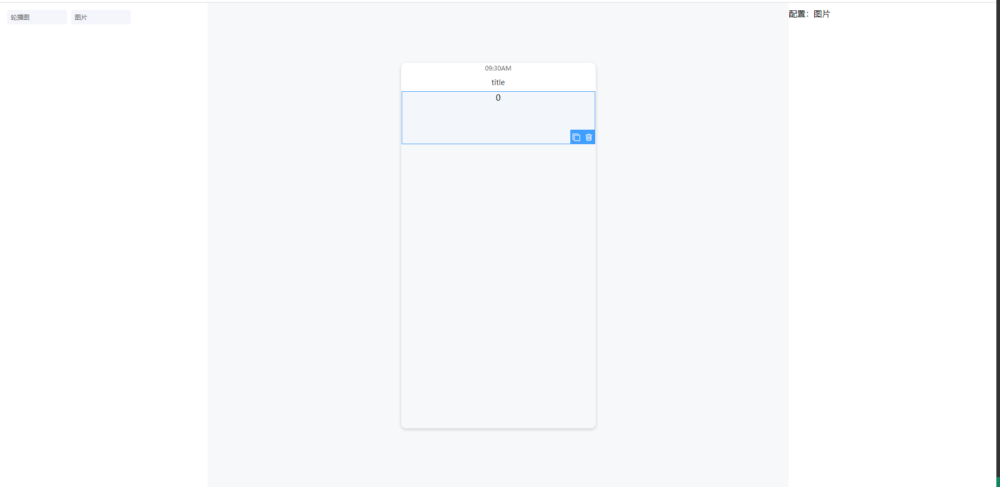

#### 🚀 Installation

```bash
npm install v-drag-layout
# or
yarn add v-drag-layout
```

##### Using Connection String

```javascript
// main.js
import Vue from "vue";
import VDragLayout from "v-drag-layout";
Vue.use(VDragLayout);
```

<!-- vue file -->

```html
<template>
  <v-drag-layout
    :options="options"
    v-model="data"
    @click:nav="handleClickNavClick"
    @select="handleWidgetSelect"
  >
    <!-- 左侧 -->
    <template #widget="{ data }"> {{ data.name }} </template>
    <!-- 视图 -->
    <template #view="{ index }">
      <div style="height: 100px">{{ index }}</div>
    </template>
    <!-- 配置 -->
    <template #empty>从左侧拖拽来添加视图</template>
    <!-- 视图 -->
    <template #conf="{ data }">{{ data }} </template>
    <!-- 页面 -->
    <!-- <template #page="{ data }">{{ data }}</template> -->
  </v-drag-layout>
</template>
<script>
  export default {
    data() {
      return {
        options: [
          {
            type: "banner",
            name: "轮播图",
            icon: "icon-tupian",
            options: {
              value: [],
            },
          },
          {
            type: "image",
            name: "图片",
            icon: "icon-tupian",
            options: {
              value: [],
            },
          },
        ],
        data: {
          views: [],
          config: {
            title: "页面标题",
            backgroundColor: "#f7f8f9",
            navigatorTitleColor: "#333",
            navigatorColor: "#fff",
          },
        },
      };
    },
    methods: {
      // 点击导航
      handleClickNavClick(config) {
        console.log(config);
      },
      // 视图点击
      handleWidgetSelect(view, index) {
        console.log(view, index);
      },
    },
  };
</script>
```


